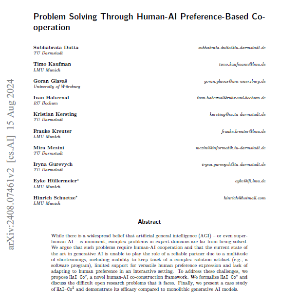
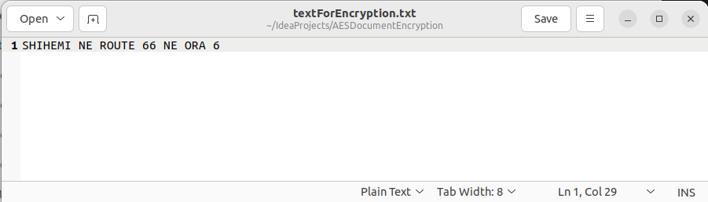
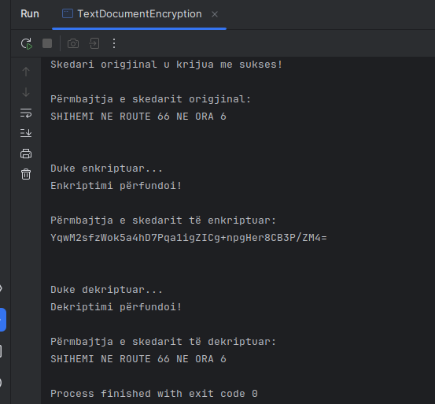

# Document Encryption Java Application

### Institution
- **Name**: University of Prishtina (UP)
- **Faculty**: Faculty of Electrical and Computer Engineering (FIEK)
- **Course**: "Siguri e Informacionit" (Information Security)
- **Program**: First Semester, Master's

## Overview

This project provides a Java-based application for encrypting and decrypting documents. It uses the **CBC (Cipher Block Chaining)** encryption mode to ensure secure handling of sensitive files. The application demonstrates secure encryption, decryption.

## Features

- **Encryption**: Securely encrypt PDF files using the CBC mode.
- **Decryption**: Restore original PDF content using the decryption process.
- **Customizable Key Management**: Define custom encryption keys for enhanced security.

## Project Structure

### Files Included:
- **`DocumentEncryption.java`**: Core class for encryption and decryption functionality.
- **`PDFDocumentEncryption.java`**: Unit tests for ensuring encryption/decryption reliability.
- **`TextDocumentEncryption.java`**: Demonstrates how to encrypt and decrypt files.
- **`LICENSE`**: License for the project.
- **`README.md`**: Documentation for the project.
- **`BookForEncryption.pdf`**: Sample PDF file for testing encryption.
- **`BookForEncryption_decrypted.pdf`**: Decrypted version of the sample PDF.
 
# Results Sample
## PDF Sample
   
 This a picture of the pdf we will try to encrypt **BookForEncryption.pdf**  
  
 This is a result from **BookForEncryption_encrpyted.pdf**, this is generated when we run file **PDFDocumentEncryption.java**
## Text file Sample
  
This is a picture of the text file we create and proceed with encryption **TextForEncryption.txt**  
 
This is the output generated when we run the file **TextDocumentEncryption.java**

[def]: pdf_encrypted.png